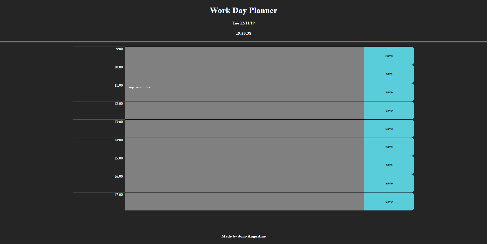

# day-planner

A simple work-day (9-17) planner with state persistence using `localStorage`.

https://jonoaugustine.github.io/day-planner

---

A simple single-day, (US) work hours planner. Each timeslot of an 
hour can be edited and saved. Past timeslots are unable to be edited.

                    GNU GENERAL PUBLIC LICENSE
                       Version 3, 29 June 2007

        Copyright (C) 2007 Free Software Foundation, Inc. <https://fsf.org/>
        Everyone is permitted to copy and distribute verbatim copies
        of this license document, but changing it is not allowed.